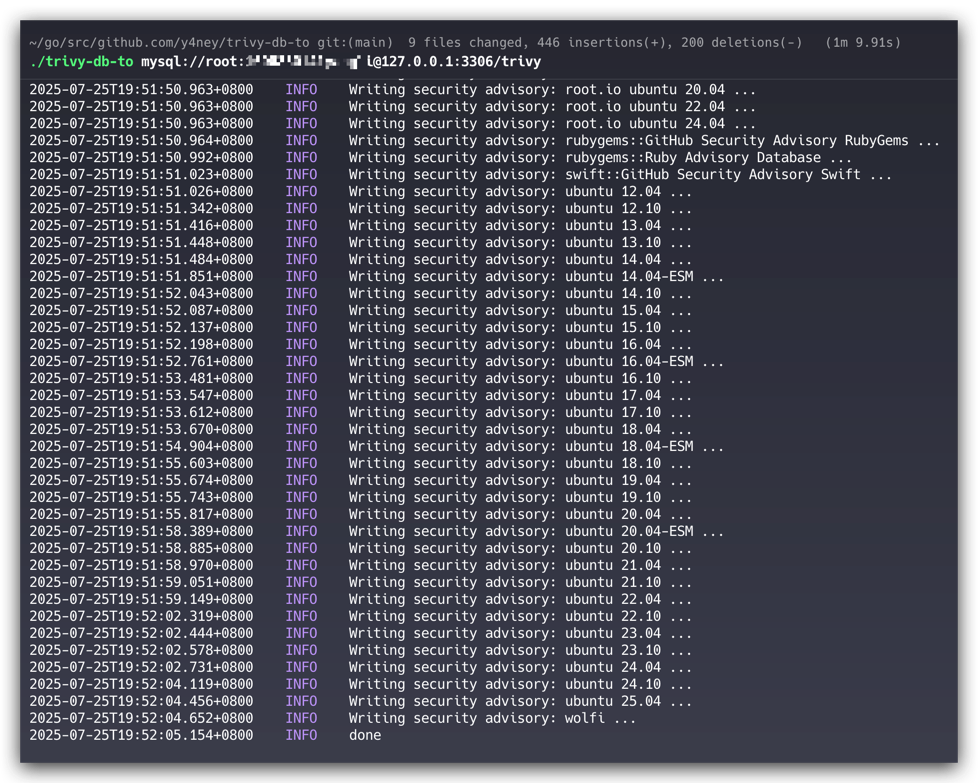

# trivy-db-to

[](https://github.com/y4ney/trivy-db-to/actions)

`trivy-db-to` 是一款用于将 [Trivy DB](https://github.com/aquasecurity/trivy-db) 中的漏洞信息迁移或转换到其他数据源的工具。

## 使用示例

1. 转化为 MySQL。

    ```bash
    trivy-db-to mysql://user:password@ip_address:port/dbname
    ```

2. 转化为 SQLite

    ```bash
    trivy-db-to sqlite:///path/to/file.db
    ```
3. 转化为 PostgreSQL。

    ```bash
   trivy-db-to postgresql://user:password@ip_address:port/dbname?sslmode=disable
    ```


## 支持的数据源

- MySQL（[数据表结构文档](docs/schema/mysql/README.md)）
- PostgreSQL（[数据表结构文档](docs/schema/postgres/README.md)）
- SQLite（[数据表结构文档](docs/schema/sqlite/README.md)）


## 安装方式

- Debian 包 (deb)

   ```bash
   export TRIVY_DB_TO_VERSION=X.X.X
   curl -o trivy-db-to.deb -L https://github.com/k1LoW/trivy-db-to/releases/download/v$TRIVY_DB_TO_VERSION/trivy-db-to_$TRIVY_DB_TO_VERSION-1_amd64.deb
   sudo dpkg -i trivy-db-to.deb
   ```

- RPM 包

   ```bash
   export TRIVY_DB_TO_VERSION=X.X.X
   sudo yum install https://github.com/k1LoW/trivy-db-to/releases/download/v$TRIVY_DB_TO_VERSION/trivy-db-to_$TRIVY_DB_TO_VERSION-1_amd64.rpm
   ```

- Alpine 包 (apk)

   ```bash
   export TRIVY_DB_TO_VERSION=X.X.X
   curl -o trivy-db-to.apk -L https://github.com/k1LoW/trivy-db-to/releases/download/v$TRIVY_DB_TO_VERSION/trivy-db-to_$TRIVY_DB_TO_VERSION-1_amd64.apk
   sudo apk add trivy-db-to.apk
   ```

- Homebrew 安装

   ```bash
   brew install k1LoW/tap/trivy-db-to
   ```

- 手动下载：从 [发布页面](https://github.com/y4ney/trivy-db-to/releases) 下载对应平台的二进制文件。

- 通过 Go 安装

   ```bash
   go install github.com/y4ney/trivy-db-to@latest
   ```

- Docker 镜像

   ```bash
   docker pull y4ney/trivy-db-to:latest
   ```
